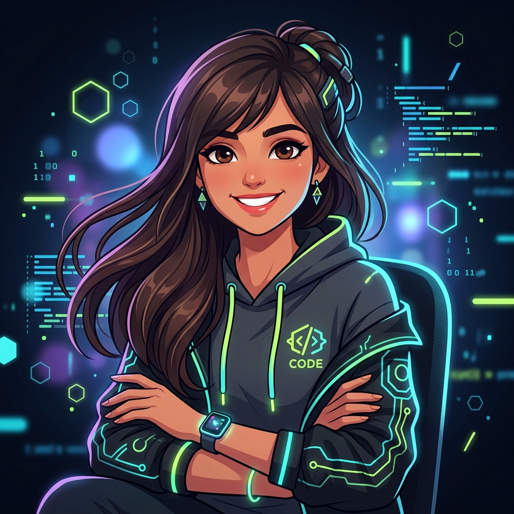
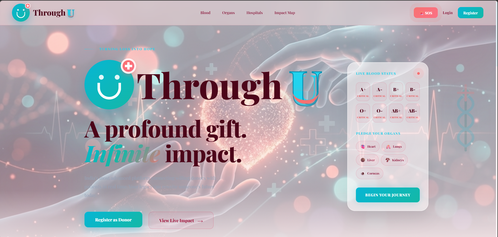
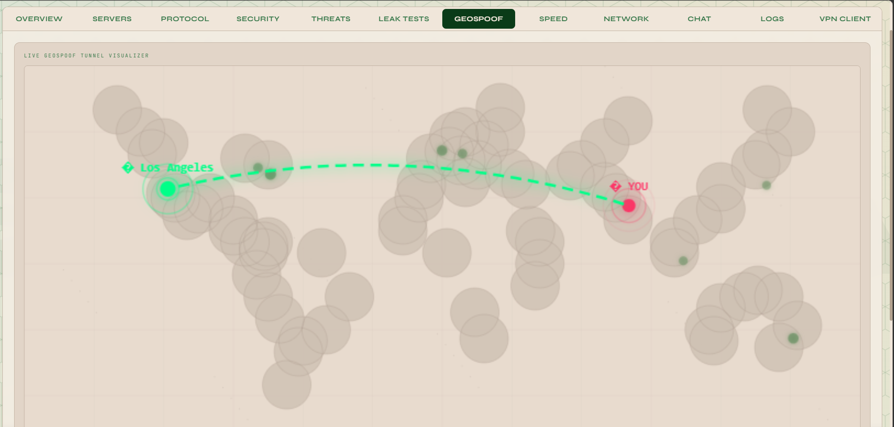
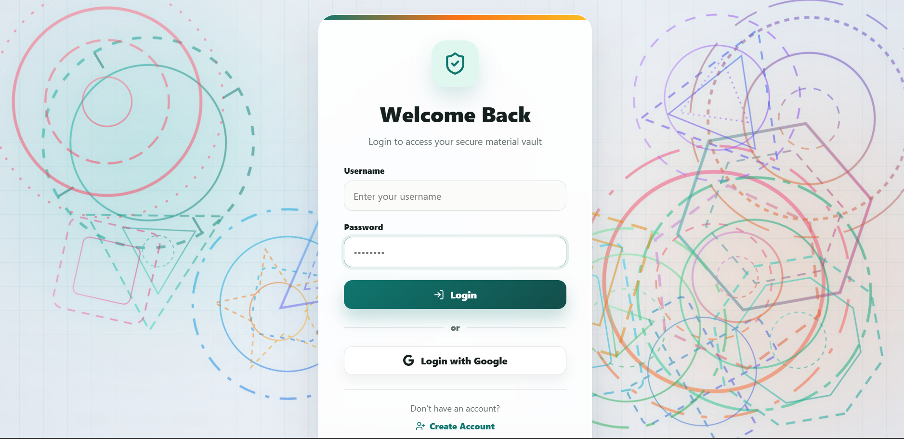
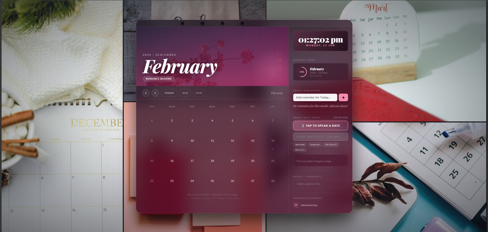
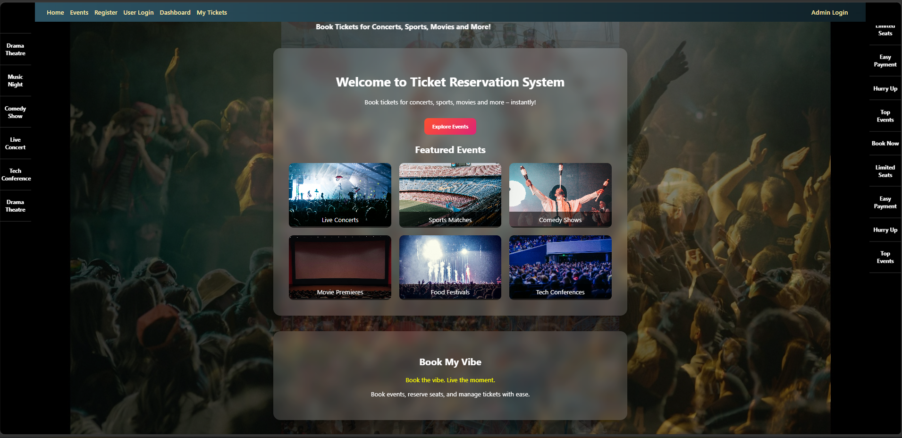

<div align="center">

<!-- EXTRAORDINARY GALACTIC NEON GRADIENT HEADER -->


<br/>

<!-- Centered Avatar Girl with Glowing Theme Border -->


<br/>

# 🪐 STACKPILOT KULSUM 🪐
### ⚔️ Full-Stack Wizard & Creative Technologist

<br/>


</div>

<br/>

<p align="center">
  
</p>

<br/>

<!-- ULTRA-UNIQUE FEATURE 1: DYNAMIC SYSTEMS TERMINAL CONSOLE -->
## 🖥️ &nbsp; stackpilot-shell --live_status

<div align="center">

```ansi
 ____________________________________________________________________
/                                                                    \
|  [SYSTEM] Booting stackpilot-os v2.7.0...                          |
|  [SYSTEM] Establishing AES-256 secure nodes... [SECURE]             |
|  [SYSTEM] Syncing Supabase PostgreSQL & socket layers... [CONNECTED]   |
|  [SYSTEM] Bootstrapping Framer Motion engines... [ACTIVE]              |
|                                                                    |
|  > info --identity                                                 |
|    ● Role       : Full-Stack Developer & Creative Technologist     |
|    ● Location   : India | Tech Enthusiast | Innovation Seeker      |
|    ● Philosophy : "Build fast. Build secure. Make it beautiful."   |
|    ● Passion    : Blending Artificial Intelligence & High-End UI   |
|                                                                    |
|  > stats --attributes                                              |
|    ⚔️ Attack (Coding Speed)  : █ █ █ █ █ █ █ █ █ ░  [ 90% ]          |
|    🛡️ Defense (Security)     : █ █ █ █ █ █ █ █ █ █  [ 100% ]         |
|    🔮 Mana (Creativity)       : █ █ █ █ █ █ █ █ █ █  [ 100% ]         |
|    ⚡ Agility (Learning Rate) : █ █ █ █ █ █ █ █ █ █  [ 100% ]         |
|    🍀 Luck (Bug Resolution)  : █ █ █ █ █ █ █ ░ ░ ░  [ 70% ]          |
\____________________________________________________________________/
```

</div>

<br/>

<p align="center">
  
</p>

<br/>

<!-- ULTRA-UNIQUE FEATURE 2: VISUAL PROJECT SHOWCASE -->
## 🖼️ &nbsp; The Visual Masterpieces

Here are the main quests I have successfully tackled and deployed. 

<br/>

<div align="center">

<table style="border: none; border-collapse: collapse;">
  <tr>
    <td width="50%" align="center" style="border: none; padding: 15px;">
      <a href="https://through-u.vercel.app" target="_blank">
        
      </a>
      <br/><br/>
      <h3><a href="https://through-u.vercel.app" style="color: #c8f55a; text-decoration: none;">❤️ Through U — Infinite Impact</a></h3>
      <p>India's most advanced platform connecting willing donors with patients in real-time. Turning loss into hope.</p>
      <code>React</code> • <code>Node.js</code> • <code>Maps API</code>
    </td>
    <td width="50%" align="center" style="border: none; padding: 15px;">
      <a href="https://nex-vpn-nova.vercel.app" target="_blank">
        
      </a>
      <br/><br/>
      <h3><a href="https://nex-vpn-nova.vercel.app" style="color: #c8f55a; text-decoration: none;">🛡️ NEXVPN Nova</a></h3>
      <p>Professional-grade VPN platform featuring GeoSpoof visualizer, leak detection, and a custom privacy score engine.</p>
      <code>Socket.IO</code> • <code>AES-256</code> • <code>React</code>
    </td>
  </tr>
  <tr>
    <td width="50%" align="center" style="border: none; padding: 15px;">
      <a href="https://materix.vercel.app" target="_blank">
        
      </a>
      <br/><br/>
      <h3><a href="https://materix.vercel.app" style="color: #c8f55a; text-decoration: none;">📁 Materix — Enterprise Vault</a></h3>
      <p>Enterprise secure document cabinet featuring Google OAuth validation, Supabase PostgreSQL indexing, and drag-drop storage.</p>
      <code>Supabase</code> • <code>PostgreSQL</code> • <code>OAuth</code>
    </td>
    <td width="50%" align="center" style="border: none; padding: 15px;">
      <a href="https://scalendra.vercel.app" target="_blank">
        
      </a>
      <br/><br/>
      <h3><a href="https://scalendra.vercel.app" style="color: #c8f55a; text-decoration: none;">🎬 Scalendra</a></h3>
      <p>Cinematic scheduling deck built with micro-particle bokeh effects, custom film grain overlays, and NLP voice recognition.</p>
      <code>Framer Motion</code> • <code>NLP</code> • <code>CSS Arrays</code>
    </td>
  </tr>
  <tr>
    <td width="100%" colspan="2" align="center" style="border: none; padding: 15px;">
      <a href="https://book--my--vibe--seven.vercel.app" target="_blank">
        
      </a>
      <br/><br/>
      <h3><a href="https://book--my--vibe--seven.vercel.app" style="color: #c8f55a; text-decoration: none;">🎟️ BookMyVibe — Event Booking</a></h3>
      <p>Live MERN ticketing dashboard with interactive venue maps, real-time ticket counts, seat selection nodes, and payment simulation.</p>
      <code>MongoDB</code> • <code>Express</code> • <code>React</code> • <code>Node.js</code>
    </td>
  </tr>
</table>

</div>

<br/>

<p align="center">
  
</p>

<br/>

## 🧬 &nbsp; Full Tech Stack

<div align="center">

### ⚡ Frontend Mastery


### 🛠️ Backend Power


### 🗄️ Database & Storage


### 🔐 Security & Authentication


### 📡 Real-Time & APIs


### 🧠 AI & Advanced Features


### ⚙️ DevOps & Infrastructure


</div>

<br/>

<p align="center">
  
</p>

<br/>

## 💡 &nbsp; Core Competencies

<div align="center">

| **Category** | **Expertise** |
|:---:|:---|
| 🎨 **Frontend** | React, Framer Motion, CSS Animations, Responsive Design, Component Architecture, Performance Optimization |
| 🏗️ **Backend** | Node.js, Express, REST APIs, Real-time Systems, Server Architecture, Microservices |
| 🔐 **Security** | JWT Authentication, OAuth 2.0, AES-256 Encryption, Secure APIs, Input Validation, CORS Protection |
| 📊 **Databases** | MongoDB, PostgreSQL, Supabase, Data Modeling, Query Optimization, Indexing Strategies |
| 🤖 **AI/ML** | NLP, Voice Recognition, Data Processing, Natural Language Commands, ML Model Integration |
| 📱 **Full-Stack** | MERN Stack, Full Application Development, Production Deployment, DevOps, Scalability |
| ⚡ **DevOps** | Git, GitHub Actions, Vercel, Render, Linux, Bash Scripting, Docker, CI/CD Pipelines |
| 🎬 **Creative Tech** | Animations, Visual Effects, UX Engineering, Interactive Design, Performance Animation |

</div>

<br/>

<p align="center">
  
</p>

<br/>


## 🎯 &nbsp; My Philosophy

> **"Build fast. Build secure. Make it beautiful."**
>
> Every line of code matters. Every feature should delight users. Every system should be bulletproof.
>
> I believe in crafting digital experiences that are not just functional, but **inspiring**—blending cutting-edge technology with thoughtful design, security-first thinking, and beautiful interactions that make people smile.

<br/>

<p align="center">
  
</p>

<br/>

<div align="center">

## 💬 &nbsp; Let's Connect & Create Something Amazing

[](mailto:malikkulsum25@gmail.com)
[](https://linkedin.com/in/kulsum-malik-43407b324)
[](https://kulsum-dev.vercel.app)
[](https://github.com/stackpilotkulsum)

<br/>

<!-- EXTRAORDINARY GALACTIC NEON GRADIENT FOOTER -->


<br/>


</div>
